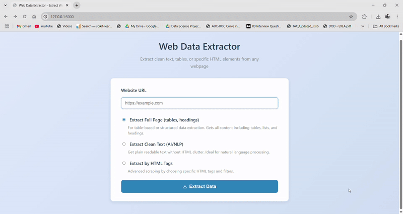
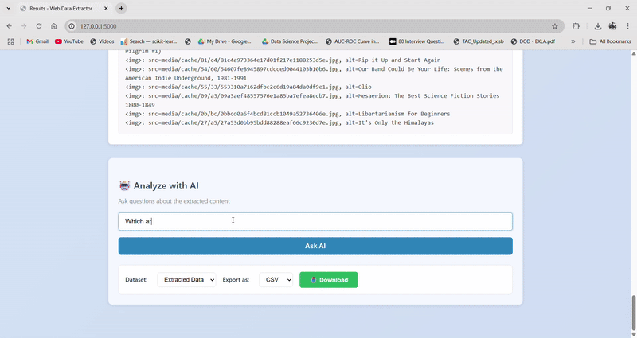
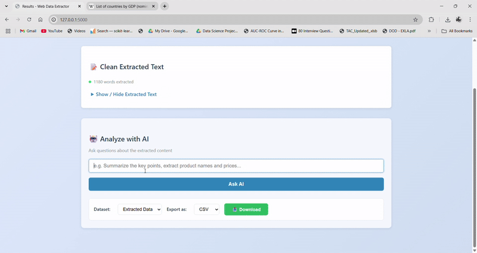

# 🌐 Web Data Extraction & AI-Powered Analysis Tool

A powerful yet user-friendly **web scraping and AI analysis** tool built with **Flask**, designed to extract clean and structured data from web pages, analyze it with an **LLM (GROQ API)**, and download results in CSV/Excel format.  
This project combines **web scraping, data processing, and AI** to assist with research, e-commerce analysis, and general data extraction tasks.

---

## 📌 Features

- **Multiple Extraction Modes**
  - **Extract Full Page (Tables, Headings)** – For rich table & structured HTML data.
  - **Extract Clean Text (AI/NLP)** – For natural language content extraction.
  - **Extract by HTML Tags** – For advanced, targeted scraping.

- **LLM-Powered Queries**
  - Ask questions about the extracted content.
  - Get answers in a **formatted HTML table**.
  - Export LLM-generated tables in CSV/Excel.

- **Data Export**
  - Download extracted data or LLM results as **CSV** or **Excel**.

- **Foldable Extracted Text Box**
  - Keeps UI clean and professional.

- **Secure API Keys**
  - Uses `.env` to store secrets like `GROQ_API_KEY`.

---

## 📸 Demo Preview

### 1️⃣ Wikipedia GDP Data (Professional / Data Analysis) 

**Step 1 — Extracting product data** 

**Step 2 — AI-powered analysis**  

---

### 2️⃣ Books to Scrape (E-commerce Data Extraction) 

**Step 1 — Extracting data** 

**Step 2 — AI-powered analysis**  

---

## 🛠 Tech Stack
- **Backend:** Flask (Python)
- **Web Scraping:** BeautifulSoup4, lxml, Playwright
- **Data Processing:** Pandas, OpenPyXL
- **AI/LLM:** GROQ API
- **Frontend:** HTML, CSS, JavaScript
- **Markdown Rendering:** python-markdown2
- **Export Formats:** CSV, Excel

---

## 📥 Installation

# 1️⃣ Clone the repository
git clone https://github.com/Akash-Sare03/web-scraper-ai-analysis.git
cd web-scraper-ai-analysis

# 2️⃣ Create a virtual environment
python -m venv venv
source venv/bin/activate   # On Mac/Linux
venv\Scripts\activate      # On Windows

# 3️⃣ Install dependencies
pip install -r requirements.txt

# 4️⃣ Create a .env file and add your API key
echo "GROQ_API_KEY=your_api_key_here" > .env

# 5️⃣ Run the Flask server
python app.py

---

## 🚀 Usage

- Open the app in your browser: http://127.0.0.1:5000/

- Choose one of the three extraction modes:

- Extract Full Page — Best for tables and headings

- Extract Clean Text — Best for NLP/AI text analysis

- Extract by HTML Tags — Advanced scraping for specific elements

- Click Extract to view results.

- (Optional) Ask AI questions based on extracted data.

- Download results in CSV or Excel.

---

## 🧠 Core Concepts

- **HTML Parsing:** Using BeautifulSoup and lxml for precise element targeting.

- **Dynamic Pages:** Handled via Playwright for JavaScript-rendered content.

- **Data Cleaning:** Removing duplicates, hidden elements, and noise.

- **AI Integration:** Sending extracted text to a GROQ LLM for advanced analysis.

- **Export Handling:** Using Pandas to create structured CSV/Excel files.

---

- **🔒 Security Notes:** Respect websites 'robots.txt' and terms of service before scraping.

---

## 🤝 Credits

- Built by [Akash Sare](https://github.com/Akash-Sare03)
- Thanks to open-source contributors for libraries used

